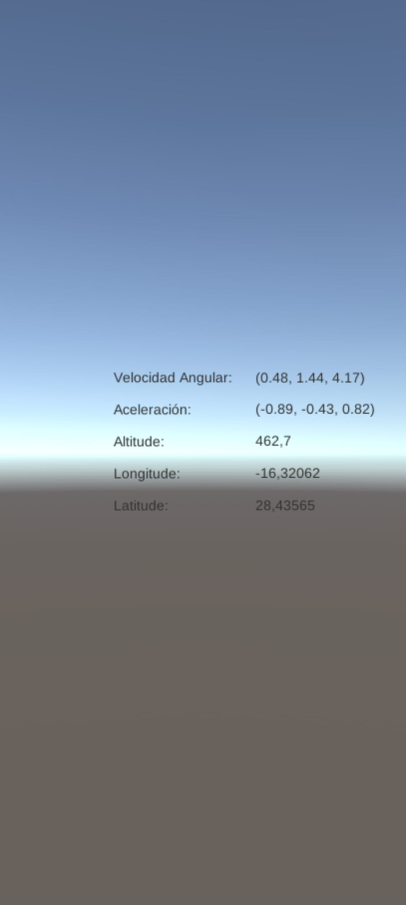

# II-P09-Sensors

Para esta práctica hemos usado distintos sensores de un dispositivo móvil para capturar datos y poder visualizar datos o dirigir un movimiento en las escenas de Unity.

Primero, se ha creado un canvas donde se muestran varios datos como velocidad, aceleración, altitud, latitud, etc. Aquí hay una captura de la ejecución de la APK: 

En el segundo ejercicio, se tiene un samurai que se mueve siempre en la misma dirección (hacia el Norte) dependiendo de la aceleracion del móvil. A continuación hay un gif de la ejecución:

